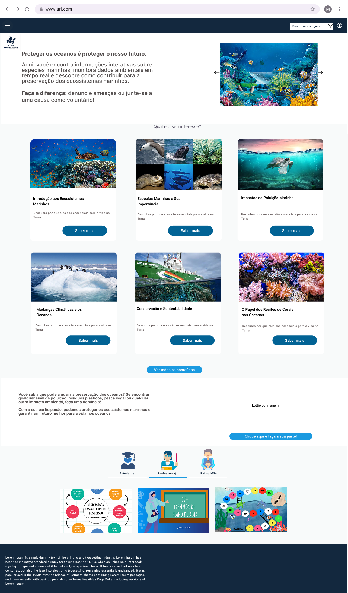
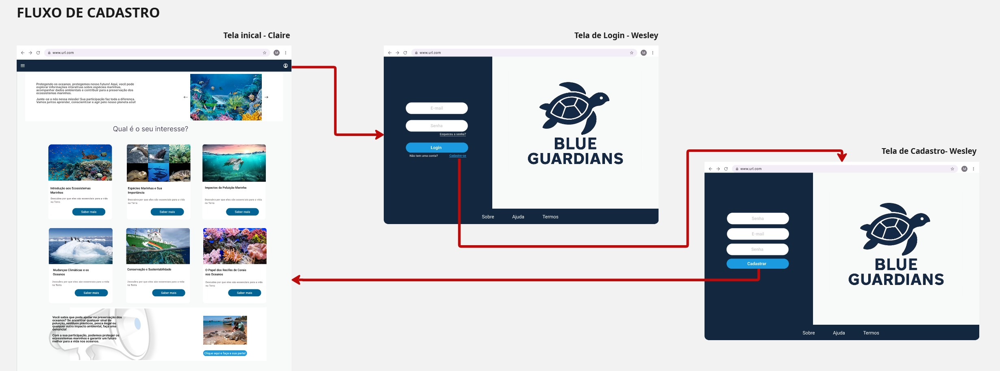
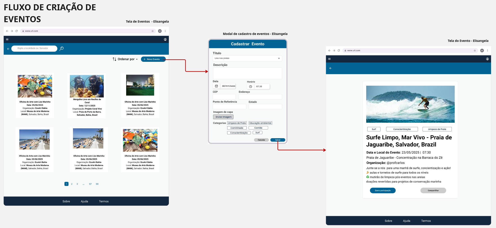
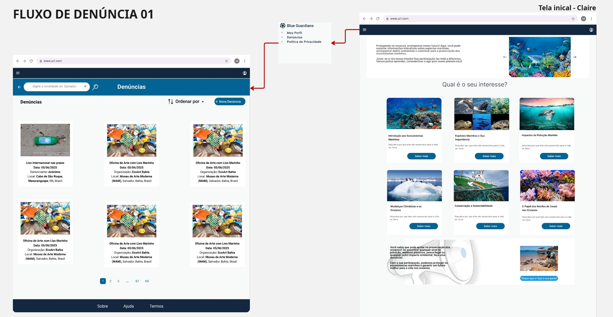
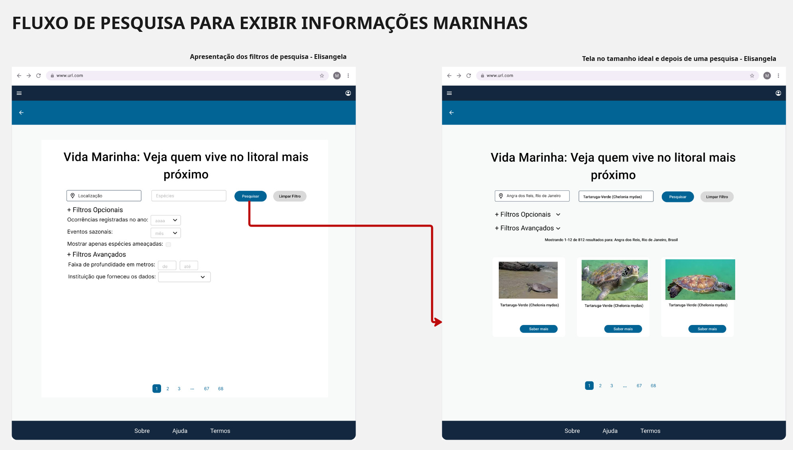
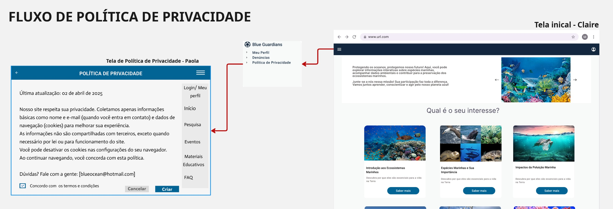

# Projeto de Interface

Visão geral da interação do usuário pelas telas do sistema e protótipo interativo das telas com as funcionalidades que fazem parte do sistema (wireframes).

 Apresente as principais interfaces da plataforma. Discuta como ela foi elaborada de forma a atender os requisitos funcionais, não funcionais e histórias de usuário abordados nas <a href="2-Especificação do Projeto.md"> Documentação de Especificação</a>.

## User Flow
Link do userflow completo: https://miro.com/app/board/uXjVIJ8uCNs=/

  
  
  
  

## Wireframes

Link do Wireframe completo: https://miro.com/app/board/uXjVIFBgY0o=/

São protótipos usados em design de interface para sugerir a estrutura de um site web e seu relacionamentos entre suas páginas. Um wireframe web é uma ilustração semelhante do layout de elementos fundamentais na interface e é fundamental sempre relacionar cada wireframe com o(s) requisito(s) que ele atende.

### Tela Inicial

